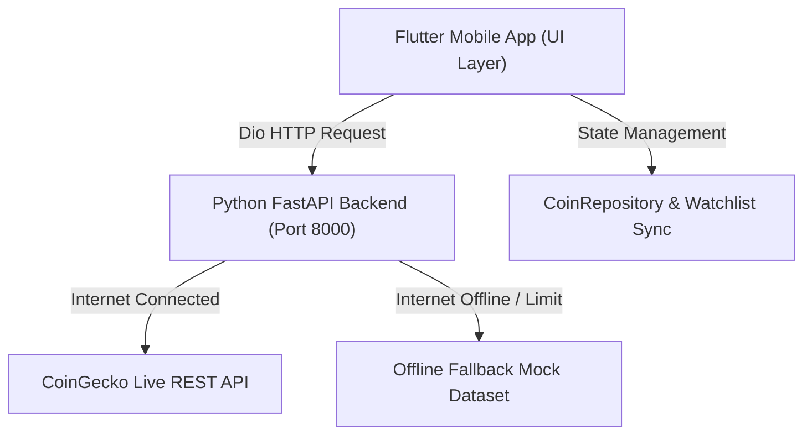

# 🚀 CryptoScope — Crypto Market Research Mobile App

[](https://flutter.dev)
[](https://fastapi.tiangolo.com)
[](https://python.org)
[](https://pub.dev/packages/dio)

This document provides a complete technical overview of **CryptoScope**, a CoinGecko-style Crypto Market Research mobile application built with **Flutter**, **Python FastAPI**, and **Dio**.

---

## 📌 1. Project Overview

**CryptoScope** is a real-time cryptocurrency research and analytics app. It allows users to track crypto prices, view interactive price charts, check market cap dominance, search and filter assets, manage a synchronized watchlist, and handle API loading/error/empty states cleanly.

### 🌐 Data Fetching Behavior (Live vs Offline Mock Data)

- **Online Mode (Internet Connected)**:
  - The app connects to the **Python FastAPI backend** (`http://127.0.0.1:8000`), which fetches **Live Real-Time Data** directly from CoinGecko REST APIs.
- **Offline / Fallback Mode (No Internet or API Limit)**:
  - If the internet is disconnected, network times out, or API rate limits are hit, the backend and app automatically switch to an **Offline Mock Dataset**. This guarantees the application **never crashes** and remains 100% reliable.

---

## 🌐 2. System Architecture



---

## 📱 3. The 4 Main Screens

### 1. Markets Screen (`CoinListScreen`)
- **Purpose**: Displays market cryptocurrencies with live price, 24h % change, and mini sparkline trend charts.
- **Features**:
  - 🔍 **Search Bar**: Instant filtering by coin name or symbol.
  - 🏷 **Filter Chips**: Category filtering for `All`, `Gainers`, `Losers`, and `Top Volume`.
  - ⚡ **State Toggle Button**: Debug FAB to test `LOADING`, `ERROR`, `EMPTY`, and `SUCCESS` states.

### 2. Coin Detail Screen (`CoinDetailScreen`)
- **Purpose**: Comprehensive view of a single coin.
- **Features**:
  - 📈 **Interactive Price Chart**: Smooth curve area chart with top-to-bottom gold gradient fill (`fl_chart`) and draggable touch tooltips displaying price & timestamp.
  - ⏱ **Range Tabs**: Range selection (`1H`, `1D`, `1W`, `1M`, `1Y`) refreshing price chart data.
  - 📊 **2×2 Stats Grid**: Market Cap, 24h Volume, Circulating Supply, and All-Time High.
  - ⭐ **Watchlist Toggle**: Pin/unpin coins to global watchlist.

### 3. Market Overview Screen (`MarketStatsScreen`)
- **Purpose**: Macro-level cryptocurrency market statistics.
- **Features**:
  - 💳 **Hero Card**: Total Market Cap ($2.42 Trillion) + 24h % change badge.
  - 📊 **Dominance Bar**: Multi-segment visual bar (`BTC` 54.2%, `ETH` 16.8%, `Others` 29.0%) with legend indicators.
  - 🚀 **Top Gainers & Losers**: 24h top market movers with detail navigation.

### 4. Watchlist Screen (`WatchlistScreen`)
- **Purpose**: Displays user-pinned cryptocurrencies.
- **Features**:
  - ⭐ **Real-Time Synchronization**: Synchronizes pinned states across all screens.
  - 📦 **Empty State Design**: Custom dashed star badge (`_EmptyWatchlistState`) with a toggle button for empty state demoing.

---

## 🎨 4. Design System & Theme

| Element | Specification |
| :--- | :--- |
| **Background Color** | `#0D1117` (Deep Dark Mode) |
| **Surface Cards** | `#161B26` with 1px hairline border `#262E3D` |
| **Accent Color** | `#E8A33D` (Gold Accent) |
| **Gain / Green** | `#2FB88A` (Tint: `#16342A`) |
| **Loss / Red** | `#E85D5D` (Tint: `#35201F`) |
| **Typography** | `Sora` (Headings), `Inter` (Body UI), `IBM Plex Mono` (Prices) |

---

## 🐍 5. Python FastAPI Backend (`backend/main.py`)

Built with **FastAPI** in Python running on `http://127.0.0.1:8000`.

### REST Endpoints:
1. `GET /api/coins`: Returns market coins list with 7d sparkline points.
2. `GET /api/coins/{id}?range=1D`: Returns coin detail metrics and range price chart points.
3. `GET /api/market/stats`: Returns total market cap, market dominance, top gainers, and top losers.

---

## 🛠 6. How to Run

### Step 1: Start Backend Server
```bash
python -m uvicorn backend.main:app --port 8000 --reload
```

### Step 2: Run Flutter App
```bash
flutter run
```

---

## 🏆 7. Key Technical Highlights

1. **Clean Architecture**: Separated into Theme, Models, Services (`ApiService` + `Dio`), Repository, Widgets, and Screens.
2. **Resilient Data Fetching**: Fetches **Live Data** when online and automatically switches to **Mock Data** when offline.
3. **State Management**: Built-in visual handling for `Loading` (shimmer skeletons), `Error` (retry button), `Empty`, and `Success`.
